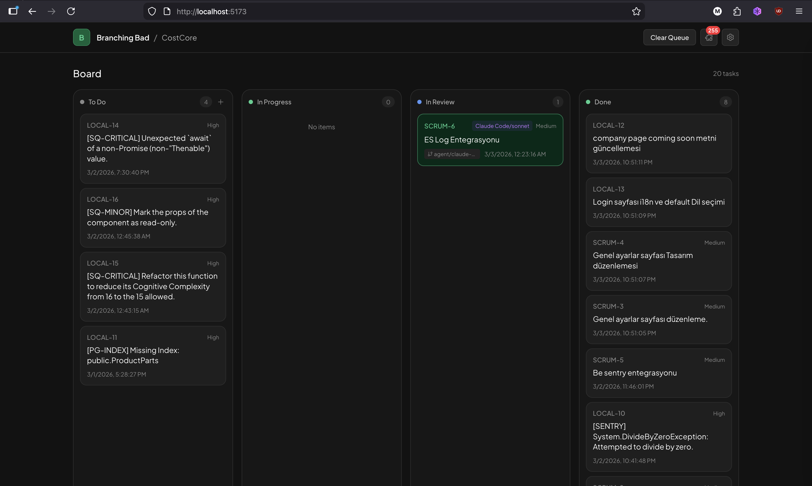
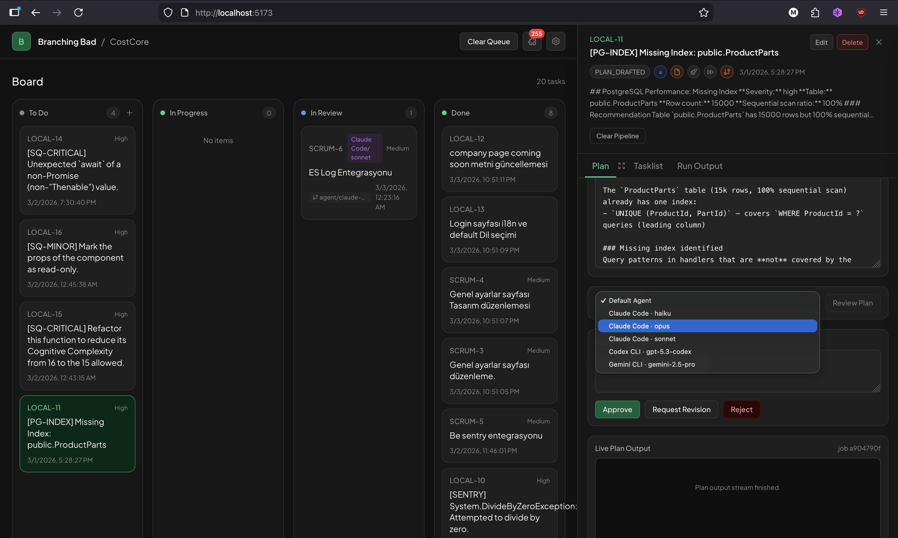
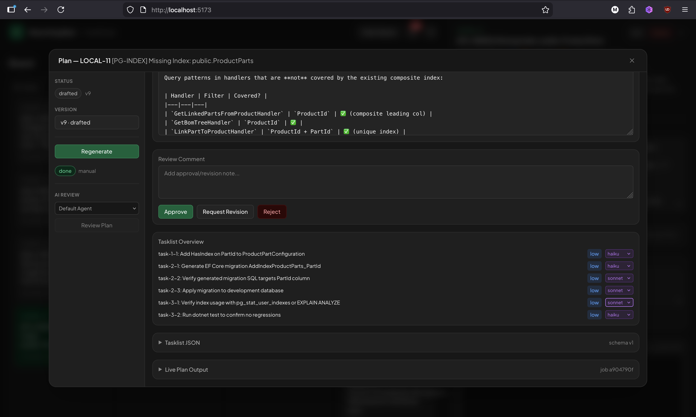
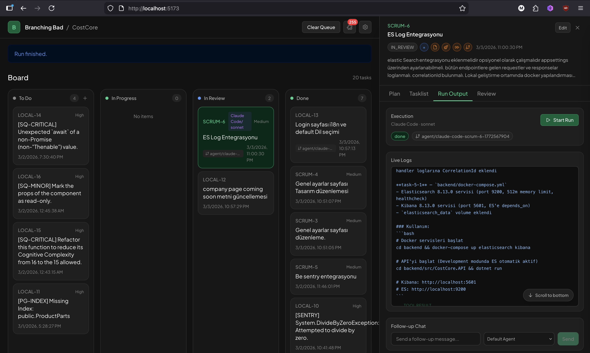
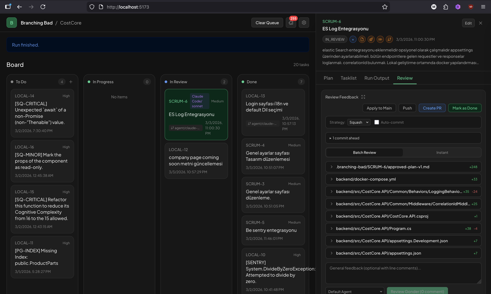
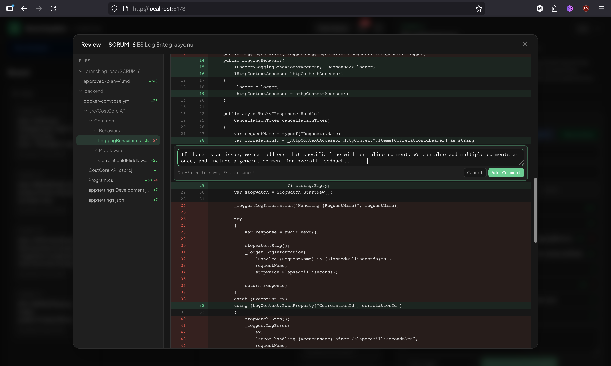
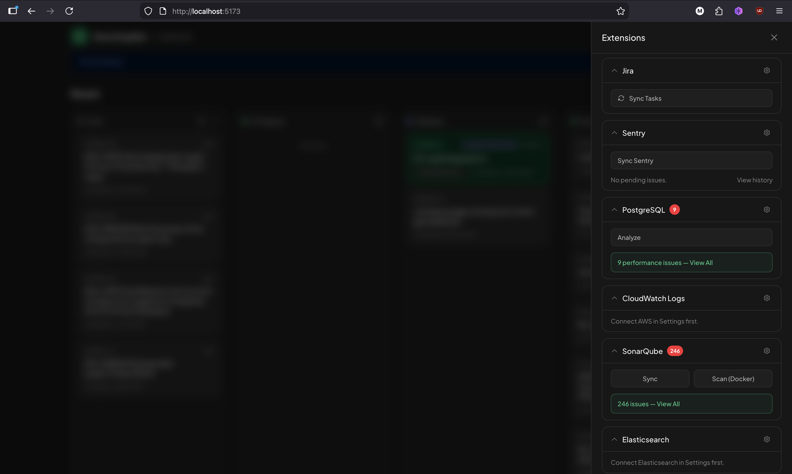
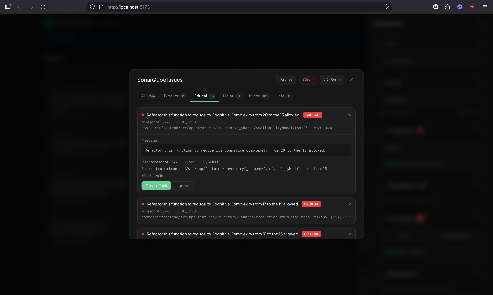

# Branching Bad

Local-first, approval-first coding agent with a pluggable provider system. Create tasks locally or sync from external services, generate AI implementation plans, review and approve before any code is written, then let the agent execute in an isolated git worktree while you keep working.



## Features

- **Local Task Management** — Create tasks directly from the kanban board, no external service required
- **External Integrations** — Sync tasks from Jira, import Sentry errors, analyze PostgreSQL performance, scan code with SonarQube
- **AI Plan Generation** — Turn task descriptions into structured implementation plans with file-level detail
- **AI Plan Review** — Have a different AI agent review the generated plan before approval
- **Structured Tasklist** — Plans include phased subtasks with dependency graphs, complexity estimates, and suggested model tiers
- **Human Approval Gate** — Plans require your approval before the agent starts (or opt into auto-approve)
- **Multi-Agent Support** — Choose between Claude Code, Codex, Gemini CLI, OpenCode, or Cursor per task
- **Isolated Execution** — Agent runs in a git worktree, your main branch stays clean
- **Live Streaming** — Watch agent thinking, tool calls, and results in real-time
- **Code Review** — Inline diff viewer with file tree, inline comments, and batch review
- **Review Feedback Loop** — Submit feedback, agent fixes, review again — iterate until satisfied
- **Merge Controls** — Squash merge, merge commit, or rebase strategies with push and PR creation via `gh` CLI
- **Follow-up Chat** — Send messages to running or completed agents with session resume support

## How It Works

### 1. Create Tasks

Create tasks directly on the kanban board — just a title and description. Or sync from Jira, import from Sentry errors, or generate from SonarQube code quality issues. Each task can be configured independently:

- **Require Plan** — Generate and approve a plan before execution (default: on)
- **Auto Approve** — Skip manual approval, plan goes straight to execution
- **Auto Start** — Agent starts automatically after plan approval
- **Use Worktree** — Run in an isolated git worktree (default: on)
- **Agent Override** — Select a different AI agent per task

### 2. Generate & Review Plans

The AI analyzes your codebase — walks the file tree, scores files by keyword relevance — and generates a structured implementation plan with markdown and a machine-readable tasklist.



Each plan includes phased subtasks with:
- Dependency graphs (blocked_by / blocks)
- Affected files list
- Acceptance criteria
- Complexity rating and suggested model tier per subtask

You can also have a separate AI agent **review the plan** before approving — catch issues before any code is written.



You can also have a different AI agent **review the plan** before approving — select an agent from the dropdown and hit "Review Plan" to get a second opinion.

Three actions: **Approve**, **Request Revision** (with comments — AI regenerates), or **Reject**.

### 3. Execute

Once approved, the agent spawns in an isolated git worktree and streams output in real-time. You see thinking blocks, tool calls, file edits, and results as they happen. The main branch stays untouched — keep editing in your IDE.



Follow-up chat lets you send messages to the running agent or resume a completed session with context.

### 4. Review & Iterate

When the agent finishes, the task moves to **In Review**. Review the diff with file tree navigation, apply to main with your preferred merge strategy, push, and create a PR — all from the UI.



Submit feedback to trigger another agent run on the same worktree — the agent picks up where it left off. Iterate until the code is right.

Expand the review modal for full-screen diff with inline commenting on specific lines.



## Providers

Connect external services to sync tasks, import issues, analyze databases, and scan code quality — all from the extensions panel. No provider is required — you can use Branching Bad purely with local tasks.



| Provider | Description |
|----------|-------------|
| **Jira** | Sync Jira board issues as kanban tasks |
| **Sentry** | Import unresolved errors, one-click "Fix" creates a task and starts plan generation |
| **PostgreSQL** | Connect to databases, analyze slow queries, import schema and performance issues |
| **CloudWatch** | AWS CloudWatch log group analysis |
| **SonarQube** | Sync issues from corporate servers, or run local Docker-based scans with quality gate management |
| **Elasticsearch** | Connect to Elasticsearch clusters for log and index analysis |

Each provider has a settings modal for connection configuration and a drawer section for quick actions like sync, scan, and issue browsing.



## Architecture

Monorepo with two main parts:

- **server-ts/** — TypeScript backend (Express + ws + better-sqlite3). HTTP server with WebSocket support, SQLite persistence. Cross-platform (macOS, Linux, Windows).
- **web/** — React frontend (React 19, Vite 7, Tailwind CSS v4). Two-column layout with kanban board and detail sidebar.

## Getting Started

### Prerequisites

- [Node.js](https://nodejs.org/) (v18+)
- At least one AI agent CLI installed: `claude`, `codex`, `gemini`, `opencode`, or `cursor`
- [Docker](https://www.docker.com/) (optional, for SonarQube local scanning)

### Install & Run

```bash
# Install dependencies
npm install
cd server-ts && npm install && cd ..
cd web && npm install && cd ..

# Development (runs backend + frontend concurrently)
npm run dev
```

Open http://localhost:5173 — backend runs on http://localhost:4310 (frontend proxies `/api` automatically).

### Commands

```bash
npm run dev              # Run backend + frontend concurrently
npm run dev:server       # TypeScript backend only (tsx watch)
npm run dev:web          # Vite frontend only
npm run build            # Production build (web + tsc)
npm run typecheck        # Frontend type checking
npm run check:server     # tsc --noEmit on server-ts
```

## Configuration

| Variable | Description | Default |
|----------|-------------|---------|
| `PORT` | Backend port | `4310` |
| `APP_DATA_DIR` | SQLite database directory | OS app data dir |

Database location:
- macOS: `~/Library/Application Support/branching-bad/agent.db`
- Linux: `~/.local/share/branching-bad/agent.db`
- Windows: `%APPDATA%\branching-bad\agent.db`

## Task Lifecycle

```
TODO → PLAN_GENERATING → PLAN_DRAFTED → PLAN_APPROVED → IN_PROGRESS → IN_REVIEW → DONE/FAILED
                                ↓              ↑
                     PLAN_REVISE_REQUESTED ─────┘
```
